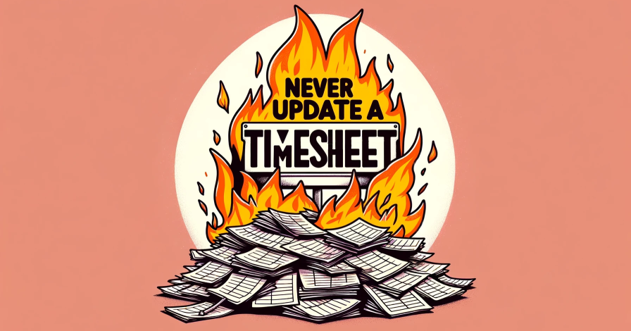

# Project Never-Update-A-Timesheet

## Description
I built this so that I can leverage my time-blocking strategy for tracking project time in a google sheet.

## Features
* Retrieve events and tasks from the Reclaim.ai API

## Reclaim.ai Setup
* Get your reclaim.ai API secret at 
* rename secrets.properties-example and add your api key to `api.secret`
* Name your tasks that should be counted towards SRED or IRAP using the `SRED:` or `IRAP:` prefix in the name.

## Google Sheets Setup
* 

## Contributions
Feel free to contribute via pull request. 
